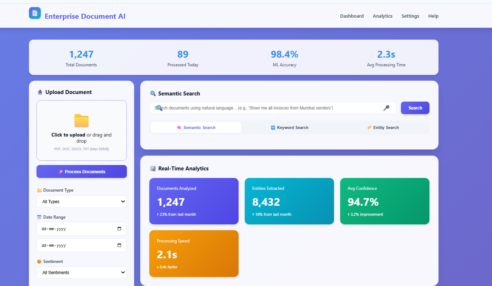
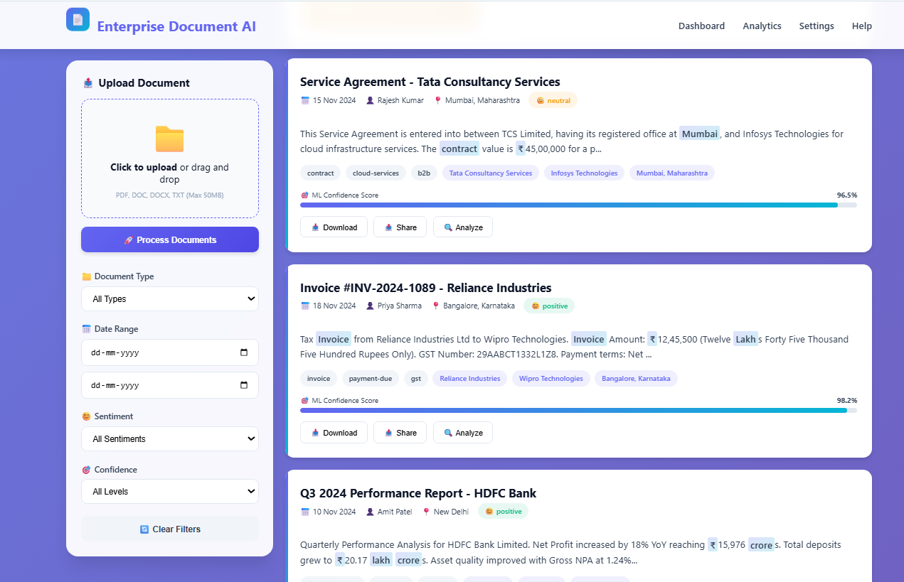

# Enterprise-Scale NLP Document Understanding & Search Web App

## Overview
This is a modern, beautiful, and fully featured web application for enterprise-scale NLP-powered document understanding and search. The app leverages a machine learning model to perform advanced NLP tasks such as semantic search, named entity recognition, sentiment analysis, and document classification on documents uploaded or queried by the user. 

---

---

## Features
- Semantic, keyword, and entity-based search modes
- Named Entity Recognition (NER) for people, orgs, locations, dates, money
- Sentiment analysis on document content
- Document upload and processing
- Multiple document type classification (invoices, contracts, reports, emails)
- Interactive analytics and confidence scoring
- Voice search and search suggestions
- Full document viewer with entity highlights
- Export results as JSON or PDF
- Responsive and animated UI with glassmorphism and gradients
- Toast notifications, loading indicators, and filter controls
